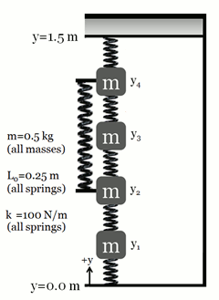
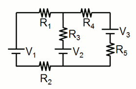

# hw_lineareqs

## Contents

  
*   [Problem 1 (homework)](#2)
*   [Problem 2 (homework)](#3)

## Problem 1 (homework)

Consider the linear mass-spring system shown. All masses (*m* = 0.5 kg), natural spring lengths (*L0* = 0.25 m), and spring constants (*k* = 100 N/m) are equal. The top spring is attached to a rigid object at height *y* = 1.5m and the bottom spring is attached at height *y* = 0.0m. Masses 2 and 4 are coupled by an additional spring, with the same natural length and spring constant as the other springs.

 * Derive the system of equations that must be solved to determine the equilibrium positions for each mass
 * Express the linear system in the form <b>Ax = b</b>
 * Write a program to determine the equilibrium positions of the masses
 
## Problem 2 (homework)

(From *Garcia*, #6 page 115) Using Kirchhoff's laws in circuit problems involves solving a set of simultaneous equations. Consider the simple circuit shown.

 * Write a program that computes the currents, given the resistances and voltages as inputs. 
 * Have your program produce a graph of the power delivered to R5 as a function of V2
 * Use this range of values for V2: 0 -- 20 V
 * Use R1 = R2 = 1 Ω, R3 = R4 = 2 Ω, R5 = 5 Ω, V1 = 2 V, V3 = 5 V.
 
Important equations:
 * Kirchhoff's loop rule: ΔV = 0 over any loop
 * Kirchhoff's junction rule: net current flowing into a junction = net current flowing out of the junction
 * Power delivered to a resistor: P = I2R
